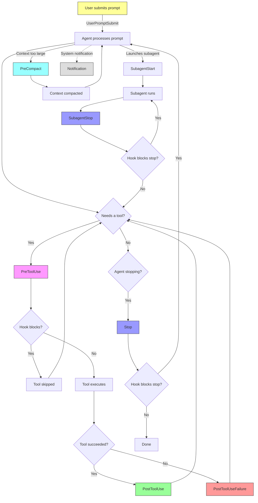

# How It Works

This page explains the full lifecycle of a captain-hook hook --- from the moment Claude Code fires an event to the JSON response that controls its behavior.

## The Hook Lifecycle

Claude Code processes user input in a loop: parse the prompt, call tools, read results, decide whether to continue or stop. Hooks intercept this loop at specific points.



**Key takeaway:** `PreToolUse` is the only event where a hook can *prevent* an action. `Stop` and `SubagentStop` can *force the agent to continue*. All other events are advisory --- they inject context but cannot block.

## How a Hook Resolves

Let's trace a concrete example end-to-end: blocking `git stash`.

### Step 1: Define the hook

```python
from captain_hook import block_command

block_command(["git", "stash"], reason="git stash is not allowed", hint="Use jj shelve")
```

Under the hood, `block_command` calls `hook()` with these parameters:

```python
hook(
    Event.PreToolUse,
    only_if=[Tool("Bash"), Command(r"git\s+stash")],
    message="BLOCKED: git stash is not allowed. Use jj shelve.",
    block=True,
)
```

### Step 2: Claude Code fires the event

When Claude tries to run `git stash`, Claude Code sends a JSON payload to captain-hook's stdin:

```json
{
  "tool_name": "Bash",
  "tool_input": {
    "command": "git stash pop"
  },
  "transcript_path": "/tmp/claude/session/transcript.jsonl"
}
```

### Step 3: Parse into a typed event

The CLI entry point reads the JSON, resolves the event type, and constructs a typed event object:

```python
event = Event.PreToolUse
evt = PreToolUseEvent(_raw=raw, ctx=ctx)

evt.tool_name    # "Bash"
evt.command      # "git stash pop"
evt.command_line # CommandLine(primary=Command("git"), args=["stash", "pop"])
```

### Step 4: Check conditions

The dispatch pipeline calls `get_matching_hooks(evt)`, which evaluates each registered hook's conditions:

1. **Event match** --- `Event.PreToolUse` is in the hook's event set. Pass.
2. **`only_if` conditions** --- `Tool("Bash")` checks `evt.tool_name == "Bash"`. Pass. `Command(r"git\s+stash")` checks `re.search(r"git\s+stash", "git stash pop")`. Pass.
3. **`skip_if` conditions** --- none registered. Pass.
4. **Gitignore check** --- no file path involved. Pass.

All conditions pass, so this hook matches.

### Step 5: Execute the hook

Since this is a declarative hook (no handler function), dispatch calls `run_declarative`:

```python
HookResult(action=Action.block, message="BLOCKED: git stash is not allowed. Use jj shelve.")
```

### Step 6: Format the output

The result is formatted as JSON that Claude Code understands:

```json
{
  "hookSpecificOutput": {
    "hookEventName": "PreToolUse",
    "permissionDecision": "deny",
    "permissionDecisionReason": "BLOCKED: git stash is not allowed. Use jj shelve."
  }
}
```

### Step 7: Claude Code reads the result

Claude Code reads the JSON from stdout. The `permissionDecision: "deny"` tells it to skip the tool call. Claude sees the reason message and adjusts its plan accordingly.

!!! note "Block vs. Warn"
    If `block=False`, the action would be `Action.warn` instead. The output would use `additionalContext` instead of `permissionDecision: "deny"`, and Claude would see the message as advice rather than a hard stop.

## Event Quick Reference

| Event | When it fires | Event class | Key properties | Common use |
|---|---|---|---|---|
| `PreToolUse` | Before a tool executes | `PreToolUseEvent` | `tool_name`, `command`, `file`, `content` | Block dangerous commands, enforce permissions |
| `PostToolUse` | After a tool succeeds | `PostToolUseEvent` | `tool_name`, `command`, `file`, `tool_response` | Lint edits, warn on patterns, log activity |
| `PostToolUseFailure` | After a tool fails | `PostToolUseFailureEvent` | `tool_name`, `error`, `is_interrupt` | Detect repeated failures, suggest fixes |
| `UserPromptSubmit` | User submits a prompt | `UserPromptSubmitEvent` | `user_prompt` | Validate prompts, inject context |
| `Stop` | Agent is about to stop | `StopEvent` | `stop_hook_active` | Enforce completion gates, require tests |
| `SubagentStop` | Subagent finishes | `SubagentStopEvent` | `agent_type` | Validate subagent output, enforce workflows |
| `SubagentStart` | Subagent launches | `SubagentStartEvent` | `agent_type` | Inject instructions, restrict agent types |
| `PreCompact` | Before context compaction | `PreCompactEvent` | `trigger`, `custom_instructions` | Add compaction instructions |
| `Notification` | System notification | `NotificationEvent` | `message`, `title`, `notification_type` | Custom notification handling |

!!! tip "Combining events"
    Events are flags --- combine them with `|` to register one hook for multiple events:
    ```python
    hook(Event.Stop | Event.SubagentStop, message="Review before finishing", block=True)
    ```

## Three Registration Patterns

### Declarative: `hook()`

The most common pattern. Specify the event, conditions, message, and whether to block:

```python
from captain_hook import hook, Event, Tool

hook(Event.PreToolUse, only_if=[Tool("Grep")], message="Use Glob instead", block=True)
```

Best for: simple allow/block/warn decisions with static messages.

### Primitives: `block_command()`, `nudge()`, `lint()`

Pre-built patterns that handle common use cases with minimal boilerplate:

```python
from captain_hook import block_command, nudge, TouchedFile

block_command(["git", "push", "--force"], reason="Force push is banned")
nudge("Run tests before committing", only_if=[TouchedFile("**/*.py")])
```

Best for: command blocking, advisory nudges, code linting --- the patterns that cover 80% of hooks.

### Handler: `@on()`

Full control via a Python function. The handler receives the typed event and returns a `HookResult`:

```python
from captain_hook import on, Event, Tool

@on(Event.PreToolUse, only_if=[Tool("Bash")])
def check_sudo(evt):
    if evt.command and "sudo" in evt.command:
        return evt.block("sudo is not allowed in this project")
```

Best for: dynamic logic, conditional messages, state inspection, or anything the declarative API cannot express.

!!! warning "Choose the simplest pattern"
    If `hook()` or a primitive can express your intent, prefer it over `@on()`. Declarative hooks are easier to test, easier to read, and less likely to break.
