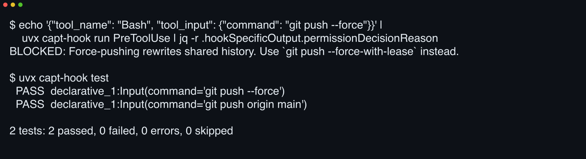

Go from nothing to a hook firing in Claude Code with one command. It creates `.claude/hooks/`, wires Claude Code's settings, drops an example hook, and installs the skills:

```bash
uvx capt-hook init
```

{width=700}

::: {.callout-note}
No install step. Every command runs through [`uvx`](https://docs.astral.sh/uv/). `uvx capt-hook …` fetches captain-hook into a throwaway environment and runs it, so it never enters your `pyproject.toml`.
:::

[ Installation](docs/getting-started/installation.qmd){.btn .btn-primary}
[ Quickstart](docs/getting-started/quickstart.qmd){.btn .btn-outline-primary}

---

<!-- gd-embed-fragment: canonical_hook -->

A few lines stop your agent from calling a UI change done before it looked at it. Each hook is declarative Python. It has an event, conditions, and an action.

---

::: {.grid}

::: {.g-col-12 .g-col-md-4}
 **Block footguns before they run**

Declare `git push --force` and `rm -rf` off-limits with one `block_command`, tests inline. [Command safety](docs/examples/command-safety.qmd)
:::

::: {.g-col-12 .g-col-md-4}
 **Learn hooks from your corrections**

The session reviewer mines each transcript and opens PRs that codify your standing rules. [Session reviewer](docs/guide/session-reviewer.qmd)
:::

::: {.g-col-12 .g-col-md-4}
 **Gate "done" on green tests**

Stop gates hold the agent until the suite ran and the artifacts exist. [Workflows](docs/guide/workflows.qmd)
:::

:::
